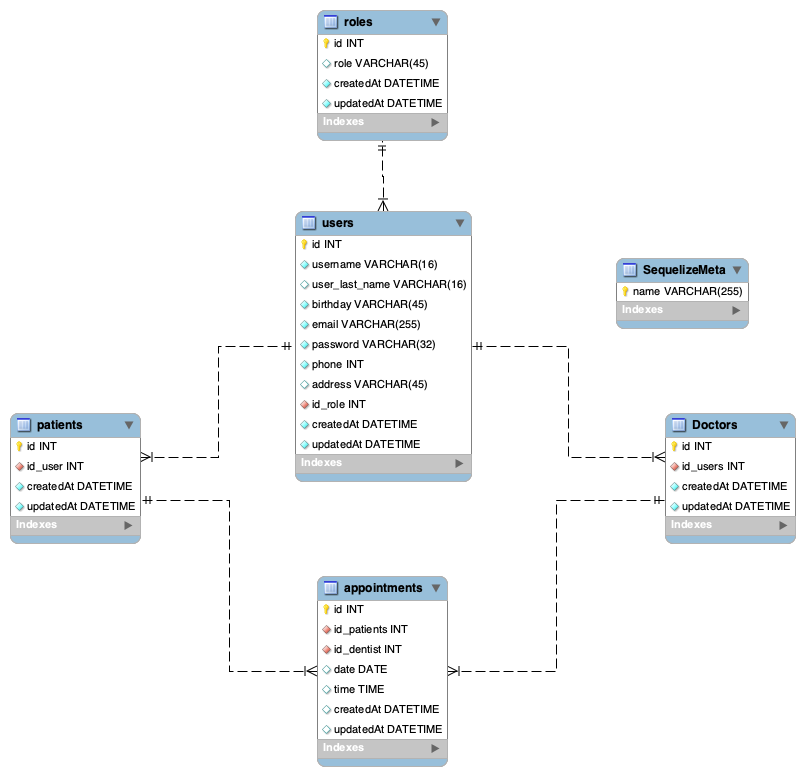

# Backend para la gestión de una Clinica Dental

<details>
  <summary>Contenido 📝</summary>
  <ol>
    <li><a href="#objetivo">Objetivo</a></li>
    <li><a href="#sobre-el-proyecto">Sobre el proyecto</a></li>
    <li><a href="#deploy-🚀">Deploy</a></li>
    <li><a href="#stack">Stack</a></li>
    <li><a href="#diagrama-bd">Diagrama</a></li>
    <li><a href="#instalación-en-local">Instalación</a></li>
    <li><a href="#endpoints">Endpoints</a></li>
    <li><a href="#contacto">Contacto</a></li>
  </ol>
</details>

## Objetivo

Crear el backend correspondiente al sistema de gestión de citas para una Clínica Dental.

## Sobre el proyecto

Aplicación API para la gestión de una base de datos de una clinica dental. Toda la gestión se realizará teniendo en cuenta tres distintos tipos de roles (admin, dentist y patient), y la autenticación está basada en un token.

## Deploy 🚀

<div align="center">
    <a href="#"><strong>Url a producción </strong></a>🚀🚀🚀
</div>

## Stack

Tecnologías utilizadas:

<div align="center">
<a href="https://developer.mozilla.org/es/docs/Web/JavaScript">
    
</a>
<a href="https://nodejs.org/es/">
    
</a>
<a href="https://sequelize.org/">
    
</a>
<a href="https://www.expressjs.com/">
    
</a>
 </div>

## Diagrama BD



## Instalación en local

1. Clonar el repositorio
2. `$ npm install`
3. Conectamos nuestro repositorio con la base de datos
4. `$ Ejecutamos las migraciones`
5. `$ Ejecutamos los seeders`
6. `$ npm run dev`

## Endpoints

<details>
<summary>Endpoints</summary>

- AUTH

  - Registrar usuario

        POST http://localhost:3000/auth/register

    body:

    ```js
        {
          "user_name": "Jose", // 3
          "user_last_name": "Palacios",
          "birthday": "1996-05-01",
          "email": "jose@palacios.com",
          "password": "12345678",
          "phone": "636382492",
          "address": "Calle del Río, 22",
        }
    ```

  - Login

        POST http://localhost:3000/auth/login

    body:

    ```js
        {
            "email": "jose@palacios.com",
            "password": "12345678"
        }
    ```

- ADMIN

  - Obtener usuarios

        GET http://localhost:3000/api/admin/users

  - Obtener usuario por id

        GET http://localhost:3000/api/admin/user/:id

  - Obtener pacientes

        GET http://localhost:3000/api/admin/patients

  - Obtener dentistas

        GET http://localhost:3000/api/admin/dentists

  - Editar usuario por id

        PUT http://localhost:3000/api/admin/update-user/:id

    body:

    ```js
        {
            "email": "jose@palacios.com"
        }
    ```

- DENTIST

  - Obtener pacientes

        GET http://localhost:3000/api/dentist/patients

  - Obtener todas mis citas

        GET http://localhost:3000/api/dentist/my-appointments

  - Borrar cita existente por la id de la cita

        DELETE http://localhost:3000/api/dentist/delete-appointment

    body:

    ```js
        {
            "id": 3
        }
    ```

- PATIENT

  - Obtener mi perfil

        GET http://localhost:3000/api/users/profile

  - Actualizar mi perfil

        PUT http://localhost:3000/api/users/update-profile

    body:

    ```js
        {
            "user_last_name": "Ferrer"
            "birthday": "1991-07-27"
        }
    ```

  - Crear una cita escogiendo el dentista

        POST http://localhost:3000/api/users/new-appointment

    body:

    ```js
        {
            {
                "id_dentist": 1,
                "date": "2023-07-14",
                "time": "10:30:00"
            }
        }
    ```

- Obtener todas mis citas

       GET http://localhost:3000/api/users/my-appointments

 </details>

## Contacto

<a href = "mailto:adriarigola@gmail.com"></a>

<a href="https://github.com/adriaarigola" target="_blank"></a>